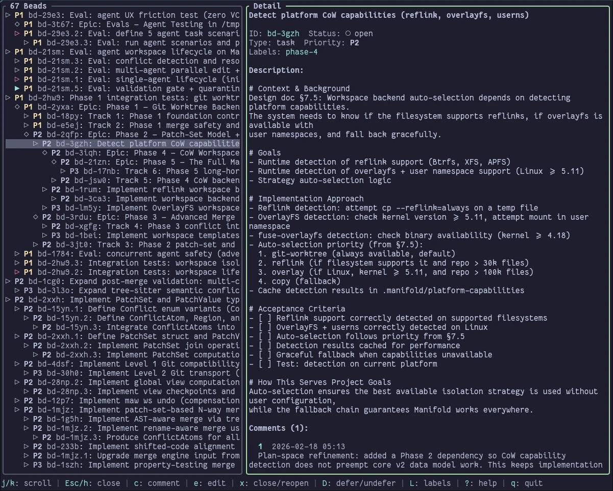

# beads-tui (bu)

A Rust/Ratatui TUI for viewing and managing [beads](https://github.com/Dicklesworthstone/beads_rust) issues.



## Features

- Two-pane layout with resizable split (list + detail)
- Tree hierarchy display for parent-child relationships
- Create beads with a modal form (lazygit commit-style)
- Cycle status with a single keypress
- Filter beads by title
- Toggle closed bead visibility
- Multiple color themes (Lazygit, Tokyo Night, Dracula, Nord)
- Mouse support (click to select, wheel to scroll)
- Auto-refresh from database

## Installation

```bash
cargo install --path .
```

Or build from source:

```bash
cargo build --release
./target/release/bu
```

## Usage

Run in a directory with a `.beads/beads.db` database:

```bash
bu
```

### Keyboard Shortcuts

| Key | Action |
|-----|--------|
| `j`/`k` | Navigate up/down |
| `u`/`d` | Page up/down (10 lines) |
| `g`/`G` | First/last item |
| `Tab` | Switch focus between panes |
| `a` | Add new bead |
| `s` | Cycle status (open -> in_progress -> closed) |
| `c` | Toggle closed bead visibility |
| `/` | Filter by title |
| `r` | Refresh from database |
| `t` | Cycle color theme |
| `<`/`>` | Resize panes (or drag divider with mouse) |
| `?` | Help |
| `q` | Quit |

### Create Modal

| Key | Action |
|-----|--------|
| `Tab` | Next field |
| `Shift+Tab` | Previous field |
| `Ctrl+S` | Submit |
| `Esc` | Cancel |

Text input supports terminal-style navigation:
- `Ctrl+A`/`Ctrl+E` - Jump to start/end
- `Ctrl+W` - Delete word backward
- `Ctrl+U`/`Ctrl+K` - Delete to start/end of line
- `Alt+B`/`Alt+F` - Move by word

## Requirements

- [beads_rust](https://github.com/Dicklesworthstone/beads_rust) (`br`) CLI for mutations
- A `.beads/beads.db` SQLite database

## Development

### Demo Script

Generate a temporary beads project with sample data for testing and screenshots:

```bash
./scripts/demo.sh
```

This creates a temporary directory with:
- Various beads across different priorities (P0-P3)
- Multiple bead types (bug, feature, task)
- Labels, comments, and dependencies
- One closed bead to show completed work

## License

MIT
